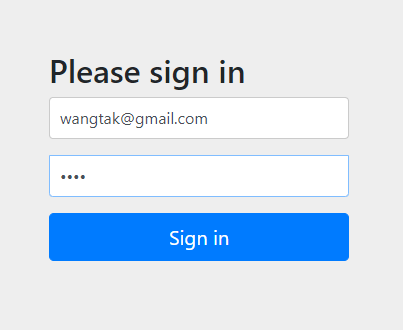

# Spring Security

## Session Clustering using Spring Data Redis

---

(필수 조건)
- H2 or MySQL etc.. (RDBMS) - Project는 H2를 사용
- Redis (for session storage)

1. Spring Application 실행 후 localhost:8080 으로 접속   

</img>

 

2. InitData 클래스에 있는 이메일 비밀번호 입력   

</img>

 

3. 정상적으로 로그인이 완료 되면 Main 화면으로 이동

</img>

 

- login 화면에서 localhost:8080/blabla ~~ 와 같은 특정 URL을 입력하여도 로그인 화면으로 리다이렉트 됨.

- maximumSessions의 값을 1로 설정했고, maxSessionsPreventsLogin을 false로 설정하였기 때문에 로그인 되어있는 브라우저 이외에 브라우저에서 같은 계정으로 로그인 했을 경우 <b>기존에 로그인되어 있는 브라우저는 자동으로 로그아웃 되며 Login 화면으로 이동</b>함.

- 블로그 : 